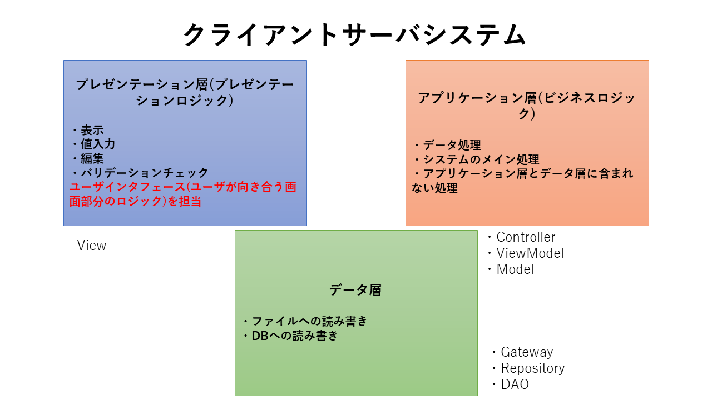

# オブジェクト指向デザインパターン

## 1. SoC(処理の分離)

  

## 2. メリット

①プログラムの鵜飼い回しができる

②改修の際、修正するものとしないものを分離できる

例：デザインパターンを利用したシステムと処理が同じでUIだけが違うシステムを新規で作成する

この時、UIに相当するプレゼンテーション層以外のロジックを使いまわしできる

また、修正を行うファイルの分離もプレゼンテーション層のみに分離できている(この場合、改修ではないが)

  

## 3. クライアントサーバシステムの概念を元にしたデザインパターン
- [ドメイン駆動設計(DDD)](https://qiita.com/ynstkt/items/ddbb905adf0583121530)
- MVC(Model View Controller)
- MVVM(Model View ViewModel> etc...
